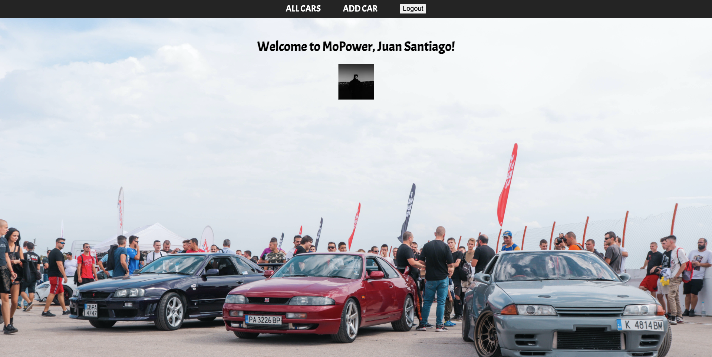

# MoPower

The following MEN stack application with full CRUD functionality is called MoPower! MoPower is a build tracker for car enthusiasts, where they can add cars that they have bought, list the modifications that they have added to their cars, comment on the builds of other users, and plan future projects. Upon loading, users will be taken to a landing page where they have the option to sign in with Google OAuth or view all the current builds made on an index view. The option to add a car is a protected route and only users who have signed in will be able to add a vehicle. Once signed in users will see an ADD CAR button displayed on the app, and have a custom message display with their name and google image. When users have added a car, they will then be able to edit or delete the car on the show view of their builds and will also be able to add the mods that they have added to their cars. All of these functions are protected and only the owners of those cars will be able to do so. Enjoy!

## Getting Started:
The following is the link to the [app](https://mo-power.herokuapp.com/) and the link to the [Trello](https://trello.com/b/w7z4rfGO/mopower).

## Technologies Used:

- Favicon.io
- Google Fonts

## Credits:
- Background image used on landing page by Chris Hristov at [Unsplash](https://unsplash.com/@itschrisyo).

## Next Steps: 
- AAU and someone that is signed in, I should be able to see all the cars that someone owns on the show page of their profile.
- AAU and owner of a mod, I should be able to delete it from my show page.
- AAU, I should be able to leave comments on the show view of another users build page.
- AAU and owner of the car, I should be able to delete the comments of other users that I do not want to see.